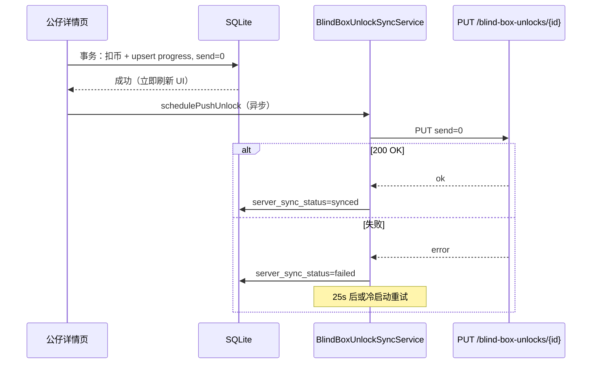

# 盲盒公仔解锁进度接口文档

与客户端本地 SQLite 表 `blind_box_unlocks` 对齐。用户在「免费领取 → 盲盒公仔」确认解封或点击「获取」申请实物后，客户端**先写本地**再**异步**调用本接口；网络失败不阻断本地进度与 Toast，后续冷启动与延迟重试会继续上报。

## 表结构（服务端建议）

```sql
CREATE TABLE IF NOT EXISTS blind_box_unlocks (
  user_id UUID NOT NULL REFERENCES user_profiles(id) ON DELETE CASCADE,
  id TEXT NOT NULL,                    -- 公仔 ID，与客户端一致（如 "1"～"48"）
  name TEXT NOT NULL,
  category_id TEXT NOT NULL,           -- 系列 Tab：0～3
  image_path TEXT,
  story_detail TEXT DEFAULT '',
  progress INTEGER NOT NULL DEFAULT 0, -- 0～100
  send INTEGER NOT NULL DEFAULT 0,     -- 0 未申请发货，1 已申请发货
  created_at TIMESTAMPTZ NOT NULL,
  updated_at TIMESTAMPTZ NOT NULL,
  PRIMARY KEY (user_id, id)
);

CREATE INDEX IF NOT EXISTS idx_blind_box_unlocks_user_category
  ON blind_box_unlocks(user_id, category_id);

CREATE INDEX IF NOT EXISTS idx_blind_box_unlocks_user_send
  ON blind_box_unlocks(user_id, category_id, send);
```

RLS：`auth.uid() = user_id`。

---

## 1. 创建或更新解锁进度（Upsert）

| 项目 | 说明 |
|------|------|
| **Method** | `PUT` |
| **Path** | `/api/v1/user/blind-box-unlocks/{id}` |
| **鉴权** | 必须。`Authorization: Bearer <access_token>`；`user_id` 以 JWT 为准，**不得**信任 Body 中的用户标识覆盖他人数据。 |

路径参数 `{id}`：公仔 ID（与客户端 `BlindBoxItem.id` 一致，如 `"7"`）。

### 请求 Body

```json
{
  "id": "7",
  "category_id": "0",
  "name": "陆孤泽",
  "image_path": "assets/free/yanyun_7.png",
  "story_detail": "",
  "progress": 60,
  "send": 0,
  "created_at": 1715000000,
  "updated_at": 1715000100
}
```

申请发货后（用户点击「获取」），同一接口再次 PUT，`send` 为 `1`：

```json
{
  "id": "1",
  "category_id": "0",
  "name": "慕容雪姬",
  "image_path": "assets/free/yanyun_1.png",
  "story_detail": "",
  "progress": 100,
  "send": 1,
  "created_at": 1715000000,
  "updated_at": 1715002000
}
```

### 字段说明

| 字段 | 类型 | 必填 | 说明 |
|------|------|------|------|
| `id` | string | 是 | 公仔 ID，须与路径参数一致 |
| `category_id` | string | 是 | 系列索引：`0` 燕云 / `1` 盛唐 / `2` 韵姑 / `3` 星宿 |
| `name` | string | 是 | 公仔名称 |
| `image_path` | string | 否 | 客户端资源路径或 CDN URL |
| `story_detail` | string | 否 | 故事描述，默认可空 |
| `progress` | int | 是 | 解锁进度 0～100（20/40/60/80/100） |
| `send` | int | 是 | `0` 未申请系列实物发货；`1` 用户已在客户端点击「获取」申请发货 |
| `created_at` | int | 是 | Unix 秒（客户端首次解锁时间） |
| `updated_at` | int | 是 | Unix 秒（本次变更时间）；服务端仅当 `updated_at` **更大**时覆盖（防乱序） |

### 成功响应 `200`

```json
{
  "ok": true,
  "data": {
    "id": "7",
    "progress": 100,
    "send": 1,
    "updated_at": 1715002000
  }
}
```

### 错误响应

| HTTP | `ok` | 说明 |
|------|------|------|
| `400` | `false` | 参数非法（如 progress 不在 0～100） |
| `401` | `false` | 未登录或 Token 失效 |
| `403` | `false` | 无权限 |
| `409` | `false` | 可选：拒绝旧 `updated_at`（客户端会重试最新本地快照） |
| `500` | `false` | 服务端错误 |

错误体示例：

```json
{
  "ok": false,
  "message": "unauthorized"
}
```

### 服务端实现要点

1. `user_id = auth.uid()`（或从 JWT 解析的服务端 UUID）。
2. `INSERT ... ON CONFLICT (user_id, id) DO UPDATE SET ... WHERE excluded.updated_at >= blind_box_unlocks.updated_at`。
3. 同一用户同一 `id` 仅保留一行；`progress` 建议不允许回退（可选）。
4. **`send` 从 `0` → `1` 时的业务处理（重要）**见下文 [§4 发货申请消息处理](#4-发货申请消息处理-send0--1)。

---

## 2. （可选）拉取当前用户全部解锁记录

| 项目 | 说明 |
|------|------|
| **Method** | `GET` |
| **Path** | `/api/v1/user/blind-box-unlocks` |
| **鉴权** | 必须 |

### 成功响应 `200`

```json
{
  "ok": true,
  "data": {
    "records": [
      {
        "id": "1",
        "category_id": "0",
        "name": "慕容雪姬",
        "image_path": "assets/free/yanyun_1.png",
        "story_detail": "",
        "progress": 100,
        "send": 0,
        "created_at": 1715000000,
        "updated_at": 1715001000
      }
    ]
  }
}
```

客户端当前版本**仅上行**（PUT），未实现下行合并；若后续做多端同步可启用本接口。

---

## 3. 客户端行为总览

| 时机 | 本地 SQLite | 服务端 |
|------|-------------|--------|
| 确认解封 | `progress` 更新，`send=0`，`server_sync_status=pending` | 异步 `PUT` 单条；失败 → `failed`，25s 重试 + 冷启动补传 |
| 系列 12 个 100% 且 `send=0`，进入盲盒 Tab | 弹出地址领取弹窗 | — |
| 点击「获取」 | 该系列 12 条 `send=1`，`server_sync_status=pending` | 异步 12 次 `PUT`（`send=1`）；失败同样重试，**不**撤回本地 `send` |
| PUT 成功 | `server_sync_status=synced` | — |

本地进度、扣币、申请成功 Toast **不依赖**接口成功。

---

## 4. 发货申请消息处理（send=0 → 1）

### 触发条件（客户端）

同一 `category_id` 下目录中 **12** 个公仔 ID 在本地均满足：

- `progress >= 100`
- `send = 0`

用户切换到「盲盒公仔」Tab 时自动弹出地址弹窗；填写/确认地址后点击 **获取**。

### 客户端处理顺序

1. 校验并保存收货地址到本地 `adress_info`（另见地址接口 `PUT /api/v1/user/addresses/{id}`）。
2. **事务外**批量 `UPDATE blind_box_unlocks SET send=1, server_sync_status='pending'`（按 12 个 `id`）。
3. 关闭弹窗，Toast「申请成功」。
4. `BlindBoxUnlockSyncService.schedulePushCategory`：对 12 个 `id` 各发起一次 `PUT`（**不 await**）。

### 服务端建议逻辑（每条 PUT，当 `send=1` 且 `progress=100`）

```
ON PUT blind_box_unlocks:
  IF auth invalid → 401
  IF progress < 100 AND send == 1 → 400（未集齐不可申请）
  UPSERT row (user_id, id, ..., send, updated_at)

  IF send changed from 0 to 1:
    -- 幂等：同一 (user_id, category_id) 仅创建一次系列发货单
    IF NOT EXISTS shipping_order WHERE user_id AND category_id AND status != 'cancelled':
      INSERT shipping_order (
        user_id, category_id, status='pending',
        address_snapshot FROM latest user address,
        doll_ids = all ids in category with progress=100
      )
      OPTIONAL: enqueue message / webhook / 运营通知
```

| 步骤 | 说明 |
|------|------|
| 幂等 | 同一用户同一 `category_id` 重复 PUT `send=1` 不重复建单 |
| 地址 | 从 `user_addresses`（或等价表）取该用户最新一条，写入 `shipping_order.address_snapshot` |
| 校验 | 可选：仅当该系列服务端侧 12 条均为 `progress=100` 才接受 `send=1` |
| 通知 | 可选：写入 `outbox` / 发送 MQ / 邮件，payload 含 `user_id`, `category_id`, `order_id` |

### 失败与重试（客户端）

| 场景 | 本地 | 服务端 |
|------|------|--------|
| PUT 超时/5xx | `server_sync_status=failed`，`send` **保持 1** | 无变更或部分变更 |
| 25s 后 / 冷启动 | 对 `pending`/`failed` 行再次 PUT 最新快照 | 最终一致 |
| 用户已看到「申请成功」 | 不因同步失败回滚 | — |

---

## 5. 消息流（时序）

### 5.1 确认解封（progress 变更）



### 5.2 系列集齐 → 点击「获取」（send=1）

```mermaid
sequenceDiagram
  participant Tab as 盲盒 Tab
  participantDlg as 地址弹窗
  participant DB as SQLite
  participant Addr as adress_info
  participant Sync as BlindBoxUnlockSyncService
  participant API as PUT x12

  Tab->>Tab: 12× progress=100, send=0 → 弹窗
  Tab->>Dlg: 展示/编辑地址
  Dlg->>Addr: 保存地址（本地）
  Dlg->>DB: UPDATE 12 行 send=1, pending
  DB-->>Dlg: 成功
  Dlg-->>Tab: pop(true)
  Tab->>Tab: Toast 申请成功
  loop 每个公仔 id
    Tab->>Sync: schedulePushUnlock
    Sync->>API: PUT send=1, progress=100
    alt 200
      API-->>Sync: ok → synced
    else 失败
      API-->>Sync: error → failed，稍后重试
    end
  end
```

---

## 6. 与收货地址接口协作

申请发货前客户端会 Upsert 本地地址并异步同步：

- **`PUT /api/v1/user/addresses/{id}`**（见地址模块文档）

服务端在处理 `send=1` 时，应读取该用户**最新有效地址**作为发货快照，勿仅依赖盲盒 PUT Body（Body 中不含地址字段）。
